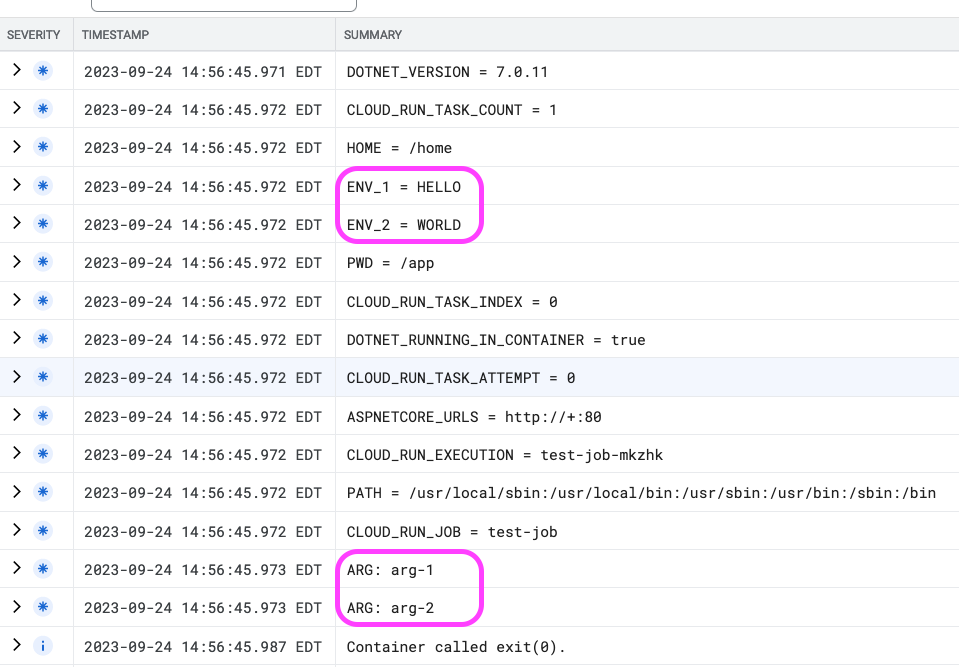

# Google Cloud Run Invoke Job

This repository contains a code example of how to invoke a Google Cloud Run Job with override parameters.

Why do you need overrides?  A simple use case is that you have a long running job that you want to trigger programmatically and pass it some parameters.  The overrides allow us to inject entry point arguments and environment variable overrides that are specific to the job invocation.

With this, now we can pass in a reference to some data in our database, for example, and process that specific data.

Let's see how we implement this.

## Create Job

The first task is to create the job definition.

In this app, we have a simple job that will just print out the environment variables and the entry point args to verify that we've received the overrides.

We're using a simple .NET 7 console app:

```csharp
var variables = Environment.GetEnvironmentVariables();

foreach (var key in variables.Keys) {
  Console.WriteLine($"{key} = {variables[key]}");
}

foreach (var arg in args) {
  Console.WriteLine($"  ARG: {arg}");
}
```

We'll need a docker file for the job:

```dockerfile
FROM --platform=$BUILDPLATFORM mcr.microsoft.com/dotnet/sdk:7.0 AS build-env
WORKDIR /app

ARG TARGETARCH
ARG BUILDPLATFORM

# Copy everything
COPY ./job/. ./
# Restore as distinct layers
RUN dotnet restore -a $TARGETARCH
# Build and publish a release
RUN dotnet publish -c Release -o published -a $TARGETARCH --no-restore

# Build runtime image
FROM mcr.microsoft.com/dotnet/runtime:7.0
WORKDIR /app
COPY --from=build-env /app/published .
ENTRYPOINT ["dotnet", "job.dll"]
```

The `build-deploy-job.sh` script will package and deploy the image into the artifact registry:

```bash
set -e

# PROJECT_ID=123 REPOSITORY=myrepo REGISTRY_REGION=us-central1 ./build-deploy-job.sh

docker buildx build \
  --push \
  --platform linux/amd64 \
  -t {REGISTRY_REGION}-docker.pkg.dev/{PROJECT_ID}/{REPOSITORY}/test-invoke-job \
  -f Dockerfile.job .
```

Note that I'm building from an M1 Mac so we'll need to create a cross-platform build.

Once we have the image, we can create the job definition:

```bash
gcloud run jobs create test-job \
  --image us-central1-docker.pkg.dev/trialsite-ai/tsai-api/test-invoke-job:latest
```
## Create API

Ideally, we want to invoke the job from some other code.  In my case, I have an API which processes a set of documents.  When I kick off the job, I want to pass in a `scope` -- think of it like a `tenantId` -- which defines which set of documents to process.

I spent quite a bit of time figuring out how to invoke this.  [A discussion on Stackoverflow](https://stackoverflow.com/questions/73561965/how-to-pass-parameters-to-google-cloud-run-job) was the first clue that this was possible.

As of this writing, the client libraries do not support this functionality.

In fact, [the documentation only shows how to do this from the console and command line](https://cloud.google.com/run/docs/execute/jobs#override-job-configuration).  However, [looking at the REST API](https://cloud.google.com/run/docs/execute/jobs#api), [it does allow sending parameters when triggering a job](https://cloud.google.com/run/docs/reference/rest/v1/namespaces.jobs/run):

```bash
curl -H "Content-Type: application/json" \
  -H "Authorization: Bearer ACCESS_TOKEN" \
  -X POST \
  -d '...' \
  https://REGION-run.googleapis.com/apis/run.googleapis.com/v1/namespaces/PROJECT-ID/jobs/JOB-NAME:run
```

To get this to work, we'll need two things:

1. Get the access token.
2. Build the request with the overrides.

### Getting an Access Token

From the container, we can [access the container metadata](https://cloud.google.com/run/docs/container-contract#metadata-server) to retrieve the token for the current user.

It's a simple `GET` request and the URL looks like so:

```
http://metadata.google.internal/computeMetadata/v1/instance/service-accounts/default/token
```

The C# code for this is simple:

```csharp
async Task<string> ResolveToken() {
  using var client = new HttpClient();

  // See: https://cloud.google.com/run/docs/container-contract#metadata-server
  client.DefaultRequestHeaders.Add("Metadata-Flavor", "Google");

  var response = await client.GetAsync(
    "http://metadata.google.internal/computeMetadata/v1/instance/service-accounts/default/token"
  );

  var token = await response.Content.ReadAsStringAsync();

  return token;
};
```

This will return the access token that we'll need to make the call to run the job.

### Build and Execute Request with Overrides

Once we have the access token, we can make the REST API call to run the job with overrides.

```csharp
var token = await ResolveToken();

var accessToken = JsonSerializer.Deserialize<Token>(token)!;

// See: https://cloud.google.com/run/docs/reference/rest/v1/namespaces.jobs/run
using var client = new HttpClient();

client.DefaultRequestHeaders.Add(
  HeaderNames.Authorization,
  $"Bearer {accessToken.access_token}"
);

var projectId = "YOUR_PROJECT_ID_HERE";
var job = "YOUR_JOB_NAME_HERE";

await client.PostAsJsonAsync(
  $"https://us-east4-run.googleapis.com/apis/run.googleapis.com/v1/namespaces/{projectId}/jobs/{job}:run",
  new RunRequest(
    Overrides: new Overrides(
      ContainerOverrides: new ContainerOverride[] {
        new(
          Name: "",
          Args: new string[] {
            "arg-1",
            "arg-2"
          },
          Env: new EnvVar[] {
            new("ENV_1", "HELLO"),
            new("ENV_2", "WORLD")
          },
          ClearArgs: false
        )
      },
      TaskCount: 1,
      TimeoutSeconds: 10
    )
  ),
  options: new () {
    PropertyNamingPolicy = JsonNamingPolicy.CamelCase
  }
);
```

The `Dockerfile` for this is equally simple:

```dockerfile
FROM --platform=$BUILDPLATFORM mcr.microsoft.com/dotnet/sdk:7.0 AS build-env
WORKDIR /app

ARG TARGETARCH
ARG BUILDPLATFORM

# Copy everything
COPY ./api/. ./
# Restore as distinct layers
RUN dotnet restore -a $TARGETARCH
# Build and publish a release
RUN dotnet publish -c Release -o published -a $TARGETARCH --no-restore

# Build runtime image
FROM mcr.microsoft.com/dotnet/aspnet:7.0
WORKDIR /app
COPY --from=build-env /app/published .
ENTRYPOINT ["dotnet", "api.dll"]
```

And to deploy:

```shell
set -e

# PROJECT_ID=123 REPOSITORY=myrepo REGISTRY_REGION=us-central1 RUNTIME_REGION=us-east4 ./build-deploy-api.sh

docker buildx build \
  --push \
  --platform linux/amd64 \
  -t {REGISTRY_REGION}.pkg.dev/{PROJECT_ID}/{REPOSITORY}/test-invoke-job-api-svc \
  -f Dockerfile.api .

# Deploy image
gcloud run deploy test-invoke-job-api-svc \
  --image={REGISTRY_REGION}-docker.pkg.dev/{PROJECT_ID}/{REPOSITORY}/test-invoke-job-api-svc:latest \
  --allow-unauthenticated \
  --min-instances=0 \
  --max-instances=1 \
  --region={RUNTIME_REGION} \
  --cpu-boost \
  --memory=256Mi
```

To confirm, we can review the log output from the job:



Nice!

Now we have a way of kicking off long running jobs in Cloud Run programmatically while passing in parameters.